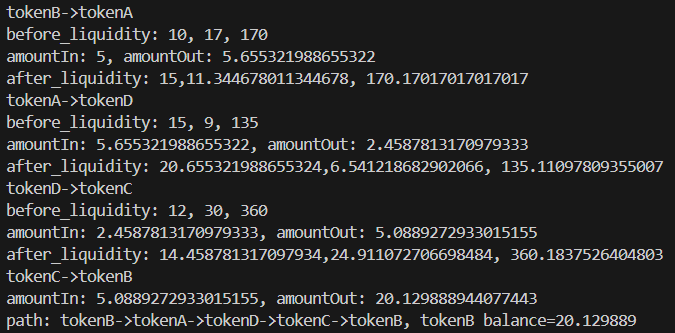

# 2024-Spring-HW2

Please complete the report problem below:


## Problem 1
Provide your profitable path, the amountIn, amountOut value for each swap, and your final reward (your tokenB balance).

> Solution
>
> 



## Problem 2
What is slippage in AMM, and how does Uniswap V2 address this issue? Please illustrate with a function as an example.

> Solution

### What is slippage in AMM?
在 AMM 中，代幣的價格是由流動池中代幣數量所決定的，通常根據某種數學公式（如常見的 x * y = k）計算得出。當某一種代幣(x)的購買量增加時，對應的代幣(y)則會相應減少，以維持流動池的總價值(k)恆定。這導致在交易中實際獲得的代幣數量與在理想情況下應該獲得的代幣數量之間存在差異，這種差異被稱為 slippage。

#### example
假設有一個流動池，其中代幣 A 的數量為 100，代幣 B 的數量為 500。當某人試圖以 1 個代幣 A 進行交易時，預期將獲得的代幣 B 數量為 4.9357，但由於滑點的存在，實際上可能會獲得稍微少於或稍微多於這個數量。滑點的大小通常取決於交易的規模以及流動性池的規模和結構
```python
print("liquidity(10,100),", "amountIn = 1,","amountOut:", getAmountOut(1, 10, 100), "tokenA:tokenB = 1:", getAmountOut(1, 10, 100))
print("liquidity(10,100),", "amountIn = 9,","amountOut:", getAmountOut(9, 10, 100), "tokenA:tokenB = 1:", getAmountOut(9, 10, 100))
```
```
liquidity(10,100), amountIn = 1, amountOut: 9.066108938801491 tokenA:tokenB = 1: 9.066108938801491
liquidity(10,100), amountIn = 9, amountOut: 47.293522373899755 tokenA:tokenB = 1: 47.293522373899755
```
### How does Uniswap V2 address this issue?
在 `swapExactTokensForTokens`, `swapExactETHForTokens` and `swapExactTokensForETH` function 中都會針對 slippage 進行確認
```solidity
require(amounts[amounts.length - 1] >= amountOutMin, 'UniswapV2Router: INSUFFICIENT_OUTPUT_AMOUNT');
```
當用戶想要用 amountIn 個 token A 換取 amountOut 個 token B 時，都會跟用戶設定的最低容忍值 amountOutMin 做比較。如果可換取的數量少於 amountOutMin 時，交易就會revert，以保護用戶免受不利的價格波動影響。

## Problem 3
Please examine the mint function in the UniswapV2Pair contract. Upon initial liquidity minting, a minimum liquidity is subtracted. What is the rationale behind this design?

> Solution

```solidity
uint public constant MINIMUM_LIQUIDITY = 10**3;
if (_totalSupply == 0) {
    liquidity = Math.sqrt(amount0.mul(amount1)).sub(MINIMUM_LIQUIDITY);
    _mint(address(0), MINIMUM_LIQUIDITY); // permanently lock the first MINIMUM_LIQUIDITY tokens
}
```
第一個提供流動性的人，需被扣除1000個LP token。這麼做的原因是為了防止某些人通過操縱 LP 代幣的供應量來控制整個流動性池。如果沒有這樣的限制，有人可以以相對較少的代幣佔據整個流動性池，然後透過其他方式增加流動性池中的資產，從而操縱 LP token 的價值。通過強制要求第一個提供流動性的人放入一定數量的 LP token，就可以讓這樣的操縱變得更加困難和昂貴。

## Problem 4
Investigate the minting function in the UniswapV2Pair contract. When depositing tokens (not for the first time), liquidity can only be obtained using a specific formula. What is the intention behind this?

> Solution

```solidity
liquidity = Math.min(amount0.mul(_totalSupply) / _reserve0, amount1.mul(_totalSupply) / _reserve1);
```
當提供流動性時，可獲得相對應的 LP token 作為 rewards。這些 LP token 的數量取決於投入代幣當時在整個流動池中的代幣比例，以及目前 LP token 的總供應量。然而取較小的比例作為最終可獲得的 LP token 數量，這樣做是為了鼓勵投入資金者根據流動池中的代幣比例增加資金。這樣做有助於保持不同代幣之間的價值相對穩定，避免因供應不平衡而引起的價格波動。

## Problem 5
What is a sandwich attack, and how might it impact you when initiating a swap?

> Solution

當發起一筆交易時，攻擊者會迅速進行兩筆相反方向的交易，以此來影響你的交易價格。這樣的攻擊導致交易時獲得的代幣數量少於預期，從而增加交易成本或減少交易可獲得的利潤。sandwich attack 會造成交易時產生不利的影響，特別是在流動性較低的市場或者交易量較大的情況下。為了減少 sandwich attack 的風險，可以考慮使用限價單、分段交易或者選擇流動性較高的交易對。
